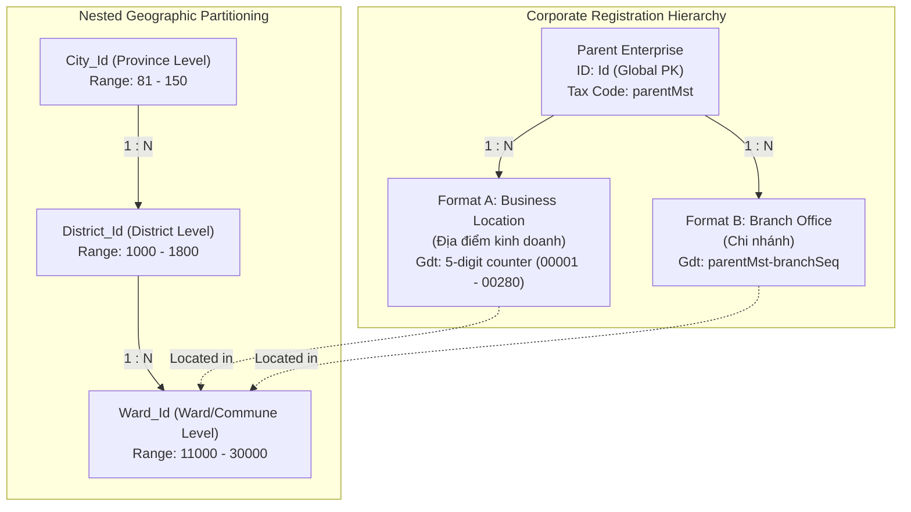

# Documentation: DKKD Database ID Hierarchy & Relationship Patterns

This document details the reverse-engineered structure, ranges, and hierarchical relationships of the unique keys used in the Vietnamese National Business Registration Portal (DKKD) database.

---

## 🗺️ 1. Entity Relationship & Hierarchy Diagram

The DKKD database organizes records using a two-tier registration hierarchy linked to a nested three-tier geographic partitioning system:



---

## 🔑 2. Geographic Key Schema & Mappings

The geographic IDs in the DKKD database are portal-specific keys (foreign keys inside the NBRP database) rather than official General Statistics Office (GSO) statistical codes.

### A. Ranges & Partitioning

| Key Level | Field Name | Numeric Range | Uniqueness Rule | Ratio vs District |
|---|---|---|---|---|
| **Province / City** | `City_Id` | `81` – `150` | Globally unique | N/A |
| **District** | `District_Id` | `1000` – `1800` | Globally unique (0% overlap across cities) | `1.00` |
| **Ward / Commune** | `Ward_Id` | `11000` – `30000` | Globally unique (nested under district) | `10.98` – `40.80` |

### B. Mapped Geographic Dictionary Examples (from Saigon Co.op)
*   **Hồ Chí Minh (`City_Id: 122`):**
    *   `District_Id: 800` $\rightarrow$ `Quận 7`
        *   `Ward_Id: 20354` $\rightarrow$ `Phường Phú Thuận`
    *   `District_Id: 815` $\rightarrow$ `Huyện Bình Chánh`
        *   `Ward_Id: 20567` $\rightarrow$ `Xã Phong Phú`
    *   `District_Id: 1676` $\rightarrow$ `Thành phố Thủ Đức`
        *   `Ward_Id: 29034` $\rightarrow$ `Phường Bình Trưng Đông`
*   **Hà Nội (`City_Id: 81`):**
    *   `District_Id: 1029` $\rightarrow$ `Quận Cầu Giấy`
    *   `District_Id: 1507` $\rightarrow$ `Huyện Đông Anh`

---

## 🏢 3. Corporate Registration Key Schema

Every physical store location is registered under an auto-incrementing primary key and linked to its parent company using one of two counter formats.

### A. Key Fields

| Field Name | Type | Purpose | Format |
|---|---|---|---|
| **`Id`** | Integer | Database Primary Key | Auto-incrementing global key (e.g. `5081469`) |
| **`Enterprise_Code`** | String | Location's Own Tax Code | 10-digit tax ID zero-padded (e.g. `0018241366`) |
| **`Enterprise_Gdt_Code`** | String | Approval Sequence Counter | Counter (Format A) or Parent-Branch ID (Format B) |

### B. Suffix Formats of `Enterprise_Gdt_Code`

#### 1. Format A (Sequential Counter)
*   **Structure:** 5-digit zero-padded counter (e.g. `00036`).
*   **Usage:** Used for **Địa điểm kinh doanh** (business locations).
*   **Scope:** Scoped locally to the parent enterprise. The parent company tax code is *not* embedded in the value; it must be resolved via the database relation or owner name.

#### 2. Format B (Branch Sequence)
*   **Structure:** 14-character string matching `^(\d{10})-(\d{3})$` (e.g. `0309129418-005`).
*   **Usage:** Used for **Chi nhánh** (branch offices).
*   **Scope:** Encodes both the parent company tax code (left 10 digits) and the branch sequential counter (right 3 digits).

---

## 📈 4. The Registration Timeline Correlation Pattern

There is a direct correlation between the internal database primary key (`Id`) and the registration sequence counter (`Enterprise_Gdt_Code`), representing the timeline of the DPI application pipeline:

$$\text{Spearman Rank Correlation } (\rho) = \mathbf{0.952384542}$$
$$\text{Pearson Correlation } (r) = \mathbf{0.905335420}$$

```
   Registration Draft Created                Application Approved
┌──────────────────────────────┐          ┌──────────────────────┐
│  ID assigned sequentially    │ ───────> │ Gdt Counter assigned │
│    (Global Key: Id)          │          │   (Local DPI Counter)│
└──────────────────────────────┘          └──────────────────────┘
```

1.  **Draft Order (`Id`):** When an applicant drafts a registration online, DKKD assigns a sequential auto-incrementing key (`Id`) globally across all companies.
2.  **Approval Order (`Enterprise_Gdt_Code`):** When DPI officers review and approve the registration, they issue the next sequential local counter (`Gdt_Code`) for that parent company.
3.  **The Noise Offset:** The $\approx 5\%$ variance in correlation is caused by parallel processing speeds: a draft application submitted earlier (lower `Id`) may take longer to review and get approved after a newer draft (yielding a higher `Gdt_Code`).
